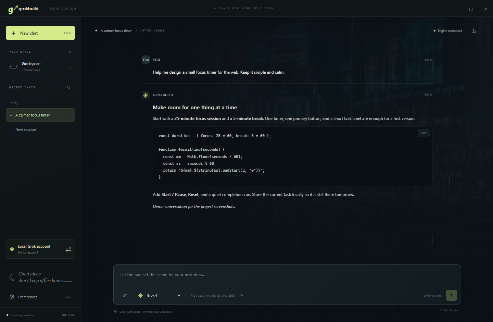

<div align="center">


# Grokbuild Tokyo

**Your ideas. After dark.**

A Tokyo rainy-night desktop home for Grok Build — built for Windows.

**English** · [简体中文](README.zh-CN.md)

[](https://github.com/swf-cmd/grokbuild-tokyo/actions/workflows/test.yml)
[](LICENSE)


[Get started](#get-started) · [User guide](docs/guide.md) · [Contribute](CONTRIBUTING.md) · [Report a bug](https://github.com/swf-cmd/grokbuild-tokyo/issues/new/choose)

</div>


Grokbuild Tokyo is an **unofficial, independent desktop client** for the locally installed [Grok Build CLI](https://github.com/xai-org/grok-build). It connects over the Agent Client Protocol (ACP), bringing streaming conversations, separate account profiles, images and file attachments into a desktop interface inspired by Tokyo after hours.

This project is not affiliated with or endorsed by xAI. Install the official CLI separately; authentication, model access and usage are handled by that CLI and your account.

## Made for long evenings of building

| Experience | What you can do |
| --- | --- |
| **A place to focus** | Rainy Shibuya scenery, optional animated rain and an original offline synth soundtrack. |
| **Conversations that stay with you** | Stream Markdown and code, search and rename chats, restore sessions and export Markdown. |
| **Separate account profiles** | Add, sign in, switch, rename and remove profiles with their own login state and history. |
| **Images and files** | Attach by picker, drag and drop, or pasted images; preview image replies and save returned files. |
| **Visibility into the work** | Follow tool progress and execution plans, respond to permission requests and stop generation. |
| **Controls backed by the CLI** | Choose the models and reasoning levels exposed by your engine; configure subagents and a workspace. |
| **Seven interface languages** | English, 简体中文, 日本語, 한국어, Español, Deutsch and Français. |



*Screenshots use an isolated demo profile and a simulated engine. Conversation text is illustrative; available models and tools depend on your installed CLI.*

## Get started

### Requirements

- **Windows x64**. The build and CI target Windows; macOS and Linux are not currently supported by this client.
- **Node.js 22.12.0 or later** and npm. Development and CI use Node.js 24.
- **Git** and an installed [Grok Build CLI](https://github.com/xai-org/grok-build#installing-the-released-binary), with account access to the service.

### Run from source

```powershell
git clone https://github.com/swf-cmd/grokbuild-tokyo.git
cd grokbuild-tokyo
npm ci
npm start
```

1. The client looks for `%USERPROFILE%\.grok\bin\grok.exe`. If yours is elsewhere, choose it in **Preferences** at the bottom left.
2. Use **Switch account** to sign in or add a profile. The local profile reuses the official CLI's existing login and configuration.
3. Choose a project folder in **Preferences**, then start a new conversation. Without a selection, the client creates a `Workspace` subfolder in the source checkout. Existing conversations keep their original folder.

English is the initial interface language. Change it in **Preferences → Interface language** and save. No API key needs to be entered into this desktop interface.

### Build the desktop app

Close the running client before building:

```powershell
npm run build
node scripts/verify-package.cjs
& '.\App\Grokbuild Tokyo.exe'
```

Keep the **entire `App` folder** together when running or distributing it. The build includes an explicit list of runtime files and licenses; the previous build is preserved under `work/package-backups`. Installing dependencies and the first build require internet access for Electron downloads. The source repository does not include a prebuilt executable.

## Everyday shortcuts

| Shortcut | Action |
| --- | --- |
| `Enter` | Send |
| `Shift + Enter` | New line |
| `Ctrl + N` | New conversation |
| `Ctrl + ,` | Preferences |
| `Esc` | Close image preview or cancel a settings preview |

## How it connects

```text
Grokbuild Tokyo (Electron)
          │
          │  ACP over a local process
          ▼
Your installed Grok Build CLI
          ├── Account authentication and model requests
          ├── Project files, tools and permission rules
          └── MCP, skills, plugins and sandbox configuration
```

The client keeps its chat history and settings locally, while the CLI handles model requests. This is not an offline model: prompts and tool context may be sent to the service by the CLI.

**Compatibility baseline:** Grok Build **1.0.13 / ACP 1**, checked on Windows on 2026-09-07. That version does not advertise native ACP image or audio input. Uploaded images and files are passed as local resource references for CLI tools to read; image replies can still be previewed. The client does not expose every TUI feature, such as interactive terminals, Git/worktree management, session forks or a slash-command menu. See the [full compatibility notes](docs/guide.md#grok-compatibility).

## Your data

`data/` contains chats, attachments, settings and account credentials saved by the CLI. It is local, excluded from Git and **not additionally encrypted by this app**. The local account may also use `GROK_HOME` (default `~/.grok`). Separate profiles isolate configuration and history, but are not operating-system sandboxes.

| Tracked in this repository | Kept out of Git |
| --- | --- |
| `src/`, `scripts/`, `tests/`, `docs/`, licenses and project configuration | `data/`, `Workspace/`, `App/`, `work/`, `node_modules/`, `.env` files |

Remote images can contact public image hosts. Read the [security policy](SECURITY.md) for permission, file access and network boundaries. Back up personal data separately; do not include it in an issue, screenshot or release archive.

## Development and contributions

```powershell
npm test
npm run test:ui
npm run test:security
```

Default tests use isolated fixtures without real model requests. Windows CI also checks accounts, attachments, languages, clocks, dependencies and the packaged application. See [CONTRIBUTING.md](CONTRIBUTING.md) for the complete checks, contribution workflow and opt-in live tests.

Bug reports, focused fixes, translations and documentation improvements are welcome. Please use [private vulnerability reporting](https://github.com/swf-cmd/grokbuild-tokyo/security/advisories/new) for sensitive security findings.

## License and credits

[MIT](LICENSE) © 2026 swf-cmd and contributors. Third-party components retain their own licenses; see [THIRD_PARTY_NOTICES.md](THIRD_PARTY_NOTICES.md) for bundled libraries, Electron and asset provenance.

The Shibuya background is AI-generated; its [prompt is included](src/renderer/assets/IMAGE-PROMPT.md). The icon is drawn by [`scripts/make-icon.py`](scripts/make-icon.py), and **Tokyo Afterimage · 東京残像** is an original synthesized instrumental generated from [`scripts/ambient-score.js`](scripts/ambient-score.js).

Built with [Electron](https://www.electronjs.org/), [Marked](https://github.com/markedjs/marked) and [DOMPurify](https://github.com/cure53/DOMPurify), connected through [ACP](https://agentclientprotocol.com/) to [Grok Build](https://github.com/xai-org/grok-build).
