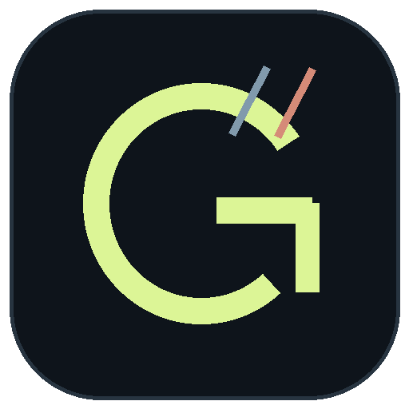
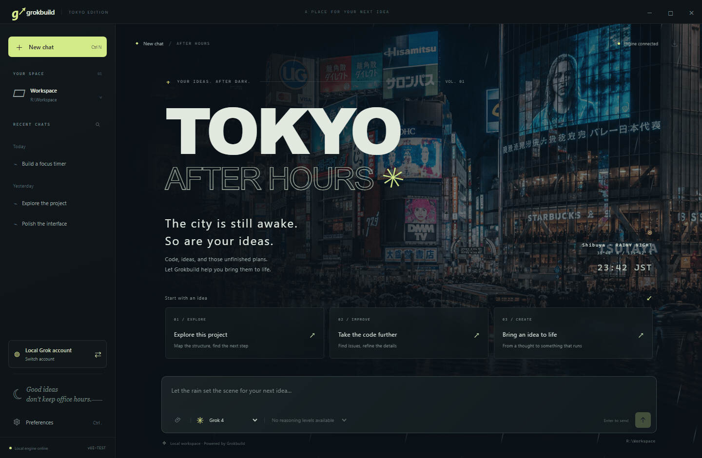

<div align="center">



# Grokbuild Tokyo

**Your ideas. After dark.**

A Tokyo rainy-night desktop client for Grok Build — unofficial, for Windows and Mac.

**English** · [简体中文](README.zh-CN.md)

[](https://github.com/swf-cmd/grokbuild-tokyo/actions/workflows/test.yml)
[](LICENSE)


[Get started](#get-started) · [Downloads](#downloads) · [User guide](docs/guide.md) · [Contribute](CONTRIBUTING.md) · [Report a bug](https://github.com/swf-cmd/grokbuild-tokyo/issues/new/choose)

</div>



*Animated rain in the Windows interface, using an isolated demo profile. Mac uses native window controls and Command-key shortcuts. [Still image](docs/images/welcome-en.png?v=motion-20260908) · [Capture details](docs/images/README.md).*

Grokbuild Tokyo is an **unofficial, independent desktop client** for the locally installed [Grok Build CLI](https://github.com/xai-org/grok-build). It connects over the Agent Client Protocol (ACP), bringing streaming conversations, separate account profiles, images and file attachments into a desktop interface inspired by Tokyo after hours.

This project is not affiliated with or endorsed by xAI. Install the official CLI separately; authentication, model access and usage are handled by that CLI and your account.

## Made for long evenings of building

| Experience | What you can do |
| --- | --- |
| **A place to focus** | Rainy Shibuya scenery, optional animated rain and an original offline synth soundtrack. |
| **Conversations that stay with you** | Stream Markdown and code, search and rename chats, restore sessions and export Markdown. |
| **Separate account profiles** | Add, sign in, switch, rename and remove profiles with their own login state and history. |
| **Images and files** | Select files, drop them onto the message composer, or paste images; preview image replies and save returned files. |
| **Visibility into the work** | Follow tool progress and execution plans, respond to permission requests and stop generation. |
| **Controls backed by the CLI** | Choose the models and reasoning levels exposed by your engine; configure subagents and a workspace. |
| **Seven interface languages** | English, 简体中文, 日本語, 한국어, Español, Deutsch and Français. |

Image input and file reading depend on the installed CLI's capabilities, tools and permissions. With the tested CLI 1.0.13, attachments are sent as local resource references for tools to read. See [attachment support and limits](docs/guide.md#chat-images-and-attachments).


*Screenshots use an isolated demo profile and a simulated engine. Conversation text is illustrative; available models and tools depend on your installed CLI.*

## Get started

### Requirements

- **Windows x64**, or **macOS 13 Ventura or later on Intel or Apple Silicon**. The universal Mac build includes both architectures. The minimum macOS version follows [Electron 44](https://www.electronjs.org/blog/electron-44-0); older Macs must be able to run macOS 13 or later. Linux is not a supported client target.
- An installed [Grok Build CLI](https://github.com/xai-org/grok-build#installing-the-released-binary), with account access to the service. The official CLI supports both Mac architectures; see its [changelog](https://x.ai/build/changelog).
- To run from source or build: **Git**, **Node.js 22.12.0 or later**, and npm. Development and CI use Node.js 24. Mac packaging also needs Apple Command Line Tools (`xcode-select --install`). Packaged apps include Electron and do not require a separate Node.js installation.

### Downloads

There is currently no published [Release](https://github.com/swf-cmd/grokbuild-tokyo/releases). The version badge identifies the source version, not a downloadable release.

- **Mac test build:** sign in to GitHub and open the latest successful `main` run in [Actions → Tests](https://github.com/swf-cmd/grokbuild-tokyo/actions/workflows/test.yml?query=branch%3Amain). Under **Artifacts**, download either `macos-universal-tested-on-arm64` or `macos-universal-tested-on-x64`. Both contain a universal app; the suffix identifies the test runner. Artifacts are retained for 14 days.
- Extract the artifact ZIP, then the enclosed `Grokbuild-Tokyo-…-mac-universal.zip`, and move **Grokbuild Tokyo.app** to **Applications**. The enclosed `.zip.sha256` applies to the inner app archive. These test builds use the ad-hoc signature described [below](#build-the-desktop-app), and still require the official CLI.
- **Windows, or expired Mac artifacts:** [run from source](#run-from-source) or [build locally](#build-the-desktop-app). Windows CI currently does not publish an app download.

### Run from source

```sh
git clone https://github.com/swf-cmd/grokbuild-tokyo.git
cd grokbuild-tokyo
npm ci
npm start
```

1. The client looks for `%USERPROFILE%\.grok\bin\grok.exe` on Windows and `~/.grok/bin/grok` on Mac. If yours is elsewhere, choose the executable in **Preferences** at the bottom left. On Mac, select `grok` without a `.exe` extension.
2. Use **Switch account** to sign in or add a profile. The local profile reuses the official CLI's existing login and configuration.
3. Choose a project folder in **Preferences**, then start a new conversation. The default is `Workspace` in the source checkout on Windows, or `~/Library/Application Support/Grokbuild Tokyo/Workspace` on Mac. Existing conversations keep their original folder.

English is the initial interface language. Change it in **Preferences → Interface language** and save. No API key needs to be entered into this desktop interface.

### Build the desktop app

Quit the running client before building. On Windows:

```powershell
npm run build
node scripts/verify-package.cjs
& '.\App\Grokbuild Tokyo.exe'
```

Keep the **entire `App` folder** together when running or distributing the Windows version.

On Mac, build one app for both Intel and Apple Silicon:

```sh
npm run build:mac
node scripts/verify-package.cjs --platform darwin --arch universal
open "App/Grokbuild Tokyo.app"
```

The shareable archive is `dist/Grokbuild-Tokyo-1.2.4-mac-universal.zip`, with a matching `.zip.sha256` checksum. Unzip it and move **Grokbuild Tokyo.app** to **Applications**. `npm run build:mac:arm64` and `npm run build:mac:x64` create smaller builds for a single architecture. `npm run build` targets the current computer; on Mac this uses its current Node.js architecture.

Mac builds are locally signed (ad hoc), without a Developer ID certificate or Apple notarization. A downloaded build may need approval in **System Settings → Privacy & Security → Open Anyway** after you verify its source; see [Apple’s instructions](https://support.apple.com/en-us/102445).

Both versions use the same interface, seven languages, chat, account, attachment, model, rain, and music features. Mac adds native window controls and menus. Closing the Mac window keeps the app and ongoing work running; click its Dock icon to reopen, or press **Cmd+Q** to quit.

Packaging uses an explicit list of runtime files and licenses; the previous `App` build is preserved under `work/package-backups`. Installing dependencies and the first build require internet access for Electron downloads. The source repository does not include prebuilt apps.

## Everyday shortcuts

| Windows | Mac | Action |
| --- | --- | --- |
| `Enter` | `Enter` | Send |
| `Shift + Enter` | `Shift + Enter` | New line |
| `Ctrl + N` | `Cmd + N` | New conversation |
| `Ctrl + ,` | `Cmd + ,` | Preferences |
| `Esc` | `Esc` | Close image preview or cancel a settings preview |

## How it connects

```text
Grokbuild Tokyo (Electron)
          │
          │  ACP over a local process
          ▼
Your installed Grok Build CLI
          ├── Account authentication and model requests
          ├── Project files, tools and permission rules
          └── MCP, skills, plugins and sandbox configuration
```

The client keeps its chat history and settings locally, while the CLI handles model requests. This is not an offline model: prompts and tool context may be sent to the service by the CLI.

**Compatibility baseline:** Grok Build **1.0.13 / ACP 1**, checked on Windows on 2026-09-07. That version does not advertise native ACP image or audio input. Uploaded images and files are passed as local resource references for CLI tools to read; image replies can still be previewed. The client does not expose every TUI feature, such as interactive terminals, Git/worktree management, session forks or a slash-command menu. See the [full compatibility notes](docs/guide.md#grok-compatibility).

## Your data

On Windows, `data/` is in the source checkout or beside the packaged `App` folder. On Mac, it is `~/Library/Application Support/Grokbuild Tokyo/data`, outside the `.app` bundle and shared by source and packaged runs. It contains chats, attachments, settings and account credentials saved by the CLI. It is local, excluded from Git and **not additionally encrypted by this app**. The local account may also use `GROK_HOME` (default `~/.grok`). Separate profiles isolate configuration and history, but are not operating-system sandboxes.

| Tracked in this repository | Kept out of Git |
| --- | --- |
| `src/`, `scripts/`, `tests/`, `docs/`, licenses and project configuration | `data/`, `Workspace/`, `App/`, `dist/`, `work/`, `node_modules/`, `.env` files |

Remote images can contact public image hosts. Read the [security policy](SECURITY.md) for permission, file access and network boundaries. Back up personal data separately; do not include it in an issue, screenshot or release archive.

## Development and contributions

```powershell
npm test
npm run test:ui
npm run test:security
```

Default tests use isolated fixtures without real model requests. CI checks accounts, attachments, languages, clocks, dependencies and the packaged application on the configured Windows and Mac runners. See [CONTRIBUTING.md](CONTRIBUTING.md) for the complete checks, contribution workflow and opt-in live tests.

Bug reports, focused fixes, translations and documentation improvements are welcome. Please use [private vulnerability reporting](https://github.com/swf-cmd/grokbuild-tokyo/security/advisories/new) for sensitive security findings.

## License and credits

[MIT](LICENSE) © 2026 swf-cmd and contributors. Third-party components retain their own licenses; see [THIRD_PARTY_NOTICES.md](THIRD_PARTY_NOTICES.md) for bundled libraries, Electron and asset provenance.

The Shibuya background is AI-generated; its [prompt is included](src/renderer/assets/IMAGE-PROMPT.md). The icon is drawn by [`scripts/make-icon.py`](scripts/make-icon.py), and **Tokyo Afterimage · 東京残像** is an original synthesized instrumental generated from [`scripts/ambient-score.js`](scripts/ambient-score.js).

Built with [Electron](https://www.electronjs.org/), [Marked](https://github.com/markedjs/marked) and [DOMPurify](https://github.com/cure53/DOMPurify), connected through [ACP](https://agentclientprotocol.com/) to [Grok Build](https://github.com/xai-org/grok-build).
