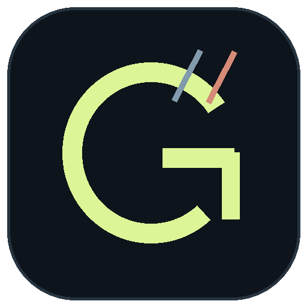

<div align="center">



# Grokbuild Tokyo

**Your ideas. After dark.**

A desktop app for the [Grok Build](https://x.ai/cli) coding agent: streaming chats, parallel tasks and separate accounts, with a rainy Tokyo night outside the window.

**English** · [简体中文](README.zh-CN.md)

[](https://github.com/swf-cmd/grokbuild-tokyo/actions/workflows/test.yml)
[](https://github.com/swf-cmd/grokbuild-tokyo/releases/latest)
[](LICENSE)


**[Download for Mac](https://github.com/swf-cmd/grokbuild-tokyo/releases/download/v1.2.4/Grokbuild-Tokyo-1.2.4-mac-universal.zip) · [Download for Windows](https://github.com/swf-cmd/grokbuild-tokyo/releases/download/v1.2.4/Grokbuild-Tokyo-1.2.4-win-x64.zip) · [All releases](https://github.com/swf-cmd/grokbuild-tokyo/releases)**

<sub>Free and open source · Unofficial · Uses the official <a href="#install-grok-build">Grok Build CLI</a>, installed separately</sub>

[Quick start](#quick-start) · [Features](#made-for-long-evenings-of-building) · [FAQ](#faq) · [User guide](docs/guide.md) · [Contribute](CONTRIBUTING.md) · [Report a bug](https://github.com/swf-cmd/grokbuild-tokyo/issues/new/choose)

</div>


*Animated rain in the Windows interface, using an isolated demo profile. Mac uses native window controls and Command-key shortcuts. [Still image](docs/images/welcome-en.png?v=20260930) · [Capture details](docs/images/README.md).*

[Grok Build](https://x.ai/cli) is the terminal coding agent from SpaceXAI (formerly xAI). Grokbuild Tokyo is an **unofficial, open-source desktop app** for it: it starts the Grok Build CLI you installed and talks to it over the [Agent Client Protocol](https://agentclientprotocol.com/) (ACP). Your sign-in, models, tools, permission rules, MCP servers and skills stay exactly as the CLI configures them. The app gives them a window worth keeping open.

This project is not affiliated with or endorsed by SpaceXAI or xAI. Authentication, model access and usage are handled by the official CLI and your account.

## Made for long evenings of building

| Experience | What you can do |
| --- | --- |
| **A place to focus** | Rainy Shibuya scenery, optional animated rain and an original offline synth soundtrack. |
| **Several tasks at once** | Run up to four conversations in parallel, each with its own progress, permission prompts, stop button and draft. |
| **Conversations that stay with you** | Stream Markdown and code, search and rename chats, restore sessions and export Markdown. |
| **See the agent at work** | Follow tool progress and execution plans, answer each permission request and stop generation at any time. |
| **Separate account profiles** | Add, sign in, switch, rename and remove profiles, each with its own login state and history. |
| **Images and files** | Pick files, drop them onto the message composer or paste images; preview image replies and save returned files. |
| **Your quota at a glance** | See how much of the account's Grok allowance is used and when it resets, right in the sidebar. |
| **Controls from your CLI** | Model choices and reasoning levels come from the CLI and update automatically; choose subagent settings and a workspace. |
| **Seven interface languages** | English, 简体中文, 日本語, 한국어, Español, Deutsch and Français. |


*Screenshots use an isolated demo profile and a simulated engine. Conversation text and quota figures are illustrative; available models and tools depend on your installed CLI.*

## Quick start

You need the official Grok Build CLI, an account with access to it, and the app for your computer.

### Install Grok Build

Install the CLI with the official installer, or follow the [official installation instructions](https://github.com/xai-org/grok-build#installing-the-released-binary):

```sh
# macOS
curl -fsSL https://x.ai/cli/install.sh | bash
```

```powershell
# Windows PowerShell
irm https://x.ai/cli/install.ps1 | iex
```

If you have already signed in to Grok Build in a terminal, the app reuses the sign-in and configuration saved in `~/.grok`. Otherwise, you can sign in from the app on first launch.

### Downloads

**[Get the latest release](https://github.com/swf-cmd/grokbuild-tokyo/releases/latest)**: public downloads, with no GitHub sign-in required.

| v1.2.4 download | Requirements | Checksum |
| --- | --- | --- |
| **[Mac universal ZIP](https://github.com/swf-cmd/grokbuild-tokyo/releases/download/v1.2.4/Grokbuild-Tokyo-1.2.4-mac-universal.zip)** · 238 MB | macOS 13 Ventura or later · Intel and Apple Silicon | [SHA-256](https://github.com/swf-cmd/grokbuild-tokyo/releases/download/v1.2.4/Grokbuild-Tokyo-1.2.4-mac-universal.zip.sha256) |
| **[Windows x64 portable ZIP](https://github.com/swf-cmd/grokbuild-tokyo/releases/download/v1.2.4/Grokbuild-Tokyo-1.2.4-win-x64.zip)** · 168 MB | Windows x64 · complete app folder, no installer | [SHA-256](https://github.com/swf-cmd/grokbuild-tokyo/releases/download/v1.2.4/Grokbuild-Tokyo-1.2.4-win-x64.zip.sha256) |

- **Mac:** unzip once, then move **Grokbuild Tokyo.app** to **Applications**. The app uses an ad-hoc signature, without a Developer ID certificate or Apple notarization. If macOS blocks the first launch, verify that you downloaded it from this repository, then follow **System Settings → Privacy & Security → Open Anyway** ([Apple's instructions](https://support.apple.com/en-us/102445)).
- **Windows:** extract the ZIP to a folder you can write to, then run **`App\Grokbuild Tokyo.exe`**. Keep the entire **`App`** folder together; this is a portable app, not an installer. The app is not code-signed. If SmartScreen appears, verify the download source before using **More info → Run anyway**, if that option is available.
- Both downloads include the desktop runtime; Node.js is only needed to [build from source](#build-from-source). The minimum macOS version follows [Electron 44](https://www.electronjs.org/blog/electron-44-0). Linux is not a supported client target.

<details>
<summary><b>Verify a download</b></summary>

Save the ZIP and its matching `.sha256` file in the same folder. On Mac:

```sh
shasum -a 256 -c Grokbuild-Tokyo-1.2.4-mac-universal.zip.sha256
```

In Windows PowerShell, compare the computed hash with the value in the `.sha256` file:

```powershell
Get-FileHash .\Grokbuild-Tokyo-1.2.4-win-x64.zip -Algorithm SHA256
Get-Content .\Grokbuild-Tokyo-1.2.4-win-x64.zip.sha256
```

</details>

### First launch

1. The client looks for `%USERPROFILE%\.grok\bin\grok.exe` on Windows and `~/.grok/bin/grok` on Mac, where the official installers put it. If yours is elsewhere (for example, with a custom `GROK_BIN_DIR` or a WinGet install), choose the executable in **Preferences** at the bottom left. `(Get-Command grok).Source` in PowerShell or `command -v grok` in a Mac terminal shows where it is. On Mac, select `grok` without a `.exe` extension.
2. If no sign-in is saved yet, choose **Sign in to Grok ↗** above the message box, then **Open sign-in page ↗**, and confirm the code in your browser. The app connects automatically once you approve. Use **Switch account** to add more profiles.
3. Choose a project folder in **Preferences**, then start a new conversation. On Windows, the default is `Workspace` beside the packaged `App` folder (or in the checkout when running from source). On Mac, it is `~/Library/Application Support/Grokbuild Tokyo/Workspace`. Existing conversations keep their original folder.

English is the initial interface language. Change it in **Preferences → Interface language** and save. No API key needs to be entered into this desktop interface.

## FAQ

<details>
<summary><b>Is this an official app?</b></summary>

No. Grokbuild Tokyo is an independent project under the MIT License and is not affiliated with or endorsed by SpaceXAI or xAI. It does not bundle or modify the CLI: it starts the Grok Build CLI you installed and shows what that CLI reports.

</details>

<details>
<summary><b>Is this the Grok Build in the Grok app?</b></summary>

No. The Grok web and mobile apps also use the Grok Build name for building apps in a chat. Grokbuild Tokyo works with Grok Build for the terminal: the `grok` command-line coding agent that works in project folders on your computer. If `grok --version` runs in a terminal, you have the CLI this app needs.

</details>

<details>
<summary><b>What does it cost?</b></summary>

The app is free. Requests are made by the Grok Build CLI under your own account and count toward that account's plan or usage, just as they would in a terminal.

</details>

<details>
<summary><b>Do I need an API key?</b></summary>

No. Signing in from the app uses the CLI's official browser login (`grok login --device-auth`), so there is nowhere to paste a key. Each profile keeps its own CLI sign-in.

</details>

<details>
<summary><b>Which Grok Build versions work?</b></summary>

The live compatibility baseline is Grok Build **1.0.13 / ACP 1**, checked on Windows on 2026-09-07. Models, reasoning levels and other options are read from the connected CLI, so keep it current with `grok update`. The app does not expose every terminal feature, such as interactive terminals, Git/worktree management, session forks or the slash-command menu. See the [full compatibility notes](docs/guide.md#grok-compatibility).

</details>

<details>
<summary><b>Can I send images and files?</b></summary>

Yes: up to 10 files per message, 20 MB each and 50 MB in total. What the model can read depends on the installed CLI's capabilities, tools and permissions. With the tested CLI 1.0.13, attachments are sent as local resource references for the CLI's tools to read. See [attachment support and limits](docs/guide.md#chat-images-and-attachments).

</details>

<details>
<summary><b>Why does macOS or Windows warn me on first launch?</b></summary>

The Mac app is ad-hoc signed and not notarized, and the Windows app is not code-signed. Make sure the download came from this repository's [releases](https://github.com/swf-cmd/grokbuild-tokyo/releases), optionally verify its SHA-256 checksum, then follow the steps in [Downloads](#downloads).

</details>

<details>
<summary><b>Does the app send my data anywhere?</b></summary>

Chats are stored on your computer. The CLI sends prompts and tool context to the service, as it would in a terminal. Besides loading images and files that replies point to, the app's only network request of its own is the optional quota card, which you can turn off. See [How it connects](#how-it-connects) and [Your data](#your-data).

</details>

## Everyday shortcuts

| Windows | Mac | Action |
| --- | --- | --- |
| `Enter` | `Enter` | Send |
| `Shift + Enter` | `Shift + Enter` | New line |
| `Ctrl + N` | `Cmd + N` | New conversation |
| `Ctrl + ,` | `Cmd + ,` | Preferences |
| `Esc` | `Esc` | Close image preview or cancel a settings preview |

## How it connects

```text
Grokbuild Tokyo (Electron)
          │
          │  ACP over a local process
          ▼
Your installed Grok Build CLI
          ├── Account authentication and model requests
          ├── Project files, tools and permission rules
          └── MCP, skills, plugins and sandbox configuration
```

The client keeps its chat history and settings locally, while the CLI handles model requests. This is not an offline model: prompts and tool context may be sent to the service by the CLI.

The optional quota card is the only request the client sends with your CLI sign-in: it asks the Grok Build billing endpoint for the active account's usage. You can turn it off with **Preferences → Show account quota**. See [Account quota](docs/guide.md#account-quota).

## Your data

On Windows, `data/` is in the source checkout or beside the packaged `App` folder. On Mac, it is `~/Library/Application Support/Grokbuild Tokyo/data`, outside the `.app` bundle and shared by source and packaged runs. It contains chats, attachments, settings and account credentials saved by the CLI. It is local, excluded from Git and **not additionally encrypted by this app**. The local account may also use `GROK_HOME` (default `~/.grok`). Separate profiles isolate configuration and history, but are not operating-system sandboxes.

Remote images can contact public image hosts. Read the [security policy](SECURITY.md) for permission, file access and network boundaries, and the [user guide](docs/guide.md#local-data-and-repository-contents) for what is kept where. Back up personal data separately; do not include it in an issue, screenshot or release archive.

## Build from source

You need **Git**, **Node.js 22.13.0 or later** and npm; development and CI use Node.js 24. Installing dependencies and the first build download Electron, so they need internet access.

```sh
git clone https://github.com/swf-cmd/grokbuild-tokyo.git
cd grokbuild-tokyo
npm ci
npm start
```

Then follow [First launch](#first-launch). See [CONTRIBUTING.md](CONTRIBUTING.md) for development checks.

> [!WARNING]
> `main` can contain changes that are not in a release yet. Since 2026-10-08, it saves chat history in a new format that v1.2.4 cannot read: v1.2.4 opens with an empty history, and switching back and forth can lose saved conversations. On Mac, source and packaged runs share one data folder, so back up `data` before running `main`, and afterwards open that data only with source builds or a newer release.

<details>
<summary><b>Package the desktop app</b></summary>

Quit the running client before building. On Windows:

```powershell
npm run build
node scripts/verify-package.cjs
& '.\App\Grokbuild Tokyo.exe'
```

Keep the **entire `App` folder** together when running or distributing the Windows version.

On Mac, install Apple Command Line Tools if needed (`xcode-select --install`), then build one app for both Intel and Apple Silicon:

```sh
npm run build:mac
node scripts/verify-package.cjs --platform darwin --arch universal
open "App/Grokbuild Tokyo.app"
```

The shareable archive is `dist/Grokbuild-Tokyo-1.2.4-mac-universal.zip`, with a matching `.zip.sha256` checksum. `npm run build:mac:arm64` and `npm run build:mac:x64` create smaller builds for a single architecture. `npm run build` targets the current computer; on Mac this uses its current Node.js architecture.

Mac builds are locally signed (ad hoc), without a Developer ID certificate or Apple notarization. Both versions share the same interface and features; Mac adds native window controls and menus. Closing the Mac window keeps the app and ongoing work running; click its Dock icon to reopen, or press **Cmd+Q** to quit.

Packaging uses an explicit list of runtime files and licenses; the previous `App` build is preserved under `work/package-backups`. The source repository does not include prebuilt apps.

</details>

## Development and contributions

```sh
npm ci
npm run test:all
```

`test:all` runs ESLint, the JavaScript type check, unit tests and every offline UI suite. Tests use isolated fixtures and a mock CLI, so they make no real model requests. CI also audits dependencies, builds the Windows and universal Mac apps, and repeats the UI suites against the packaged builds on Windows, Apple Silicon and Intel Mac. See [CONTRIBUTING.md](CONTRIBUTING.md) for the complete checks, contribution workflow and opt-in live tests.

Bug reports, focused fixes, translations and documentation improvements are welcome. Please use [private vulnerability reporting](https://github.com/swf-cmd/grokbuild-tokyo/security/advisories/new) for sensitive security findings.

If Grokbuild Tokyo keeps you company on late-night builds, starring the repository helps other people find it.

## License and credits

[MIT](LICENSE) © 2026 swf-cmd and contributors. Third-party components retain their own licenses; see [THIRD_PARTY_NOTICES.md](THIRD_PARTY_NOTICES.md) for bundled libraries, Electron and asset provenance.

The Shibuya background is AI-generated; its [prompt is included](src/renderer/assets/IMAGE-PROMPT.md). The icon is drawn by [`scripts/make-icon.py`](scripts/make-icon.py), and **Tokyo Afterimage · 東京残像** is an original synthesized instrumental generated from [`scripts/ambient-score.js`](scripts/ambient-score.js).

Built with [Electron](https://www.electronjs.org/), [Marked](https://github.com/markedjs/marked) and [DOMPurify](https://github.com/cure53/DOMPurify), connected through [ACP](https://agentclientprotocol.com/) to [Grok Build](https://github.com/xai-org/grok-build).
