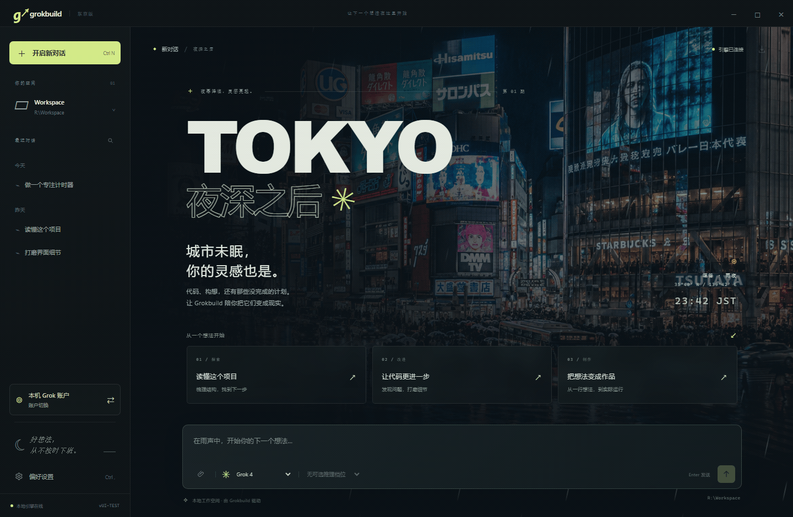

<div align="center">


# Grokbuild Tokyo · 东京雨夜

**城市未眠，你的灵感也是。**

为 Grok Build 打造的非官方 Windows 与 Mac 桌面客户端，窗外是东京的雨夜。

[English](README.md) · **简体中文**

[](https://github.com/swf-cmd/grokbuild-tokyo/actions/workflows/test.yml)
[](LICENSE)


[快速开始](#快速开始) · [下载说明](#下载说明) · [完整使用指南](docs/guide.zh-CN.md) · [参与贡献](CONTRIBUTING.zh-CN.md) · [反馈问题](https://github.com/swf-cmd/grokbuild-tokyo/issues/new/choose)

</div>



*Windows 欢迎页雨滴动态演示，使用隔离的演示账户；Mac 使用原生窗口按钮和 Command 快捷键。[静态截图](docs/images/welcome-zh-CN.png?v=motion-20260908) · [拍摄说明](docs/images/README.md)。*

Grokbuild Tokyo 是本机 [Grok Build CLI](https://github.com/xai-org/grok-build) 的**非官方、独立桌面客户端**。通过 Agent Client Protocol（ACP）连接官方引擎，把流式对话、独立账户、图片和附件放进一个有东京深夜氛围的桌面界面。

本项目与 xAI 无隶属关系，也未获其背书。需单独安装官方 CLI；登录、模型访问和用量由 CLI 及你的账户处理。

## 陪你把灵感写到深夜

| 功能 | 你可以做什么 |
| --- | --- |
| **有氛围的工作空间** | 涩谷雨夜背景、可关闭的动态雨滴，以及原创离线合成器音乐。 |
| **持续积累的对话** | 流式 Markdown 与代码块、搜索与重命名、历史恢复和 Markdown 导出。 |
| **独立账户管理** | 添加、登录、切换、重命名和删除账户，各自保存登录状态与聊天历史。 |
| **图片与文件** | 选择文件、将文件拖入消息输入区或粘贴图片，直接预览回复图片并保存返回的附件。 |
| **看得见的执行过程** | 查看工具进度和执行计划，逐项响应权限请求，随时停止生成。 |
| **跟随官方引擎的控制** | 选择 CLI 提供的模型和推理档位，设置子代理与工作目录。 |
| **七种界面语言** | 中文、English、日本語、한국어、Español、Deutsch、Français。 |

图片输入与文件读取取决于所安装 CLI 的能力、工具及权限。此前测试的 CLI 1.0.13 使用本地资源引用，由工具读取附件。详见[附件支持范围与大小限制](docs/guide.zh-CN.md#聊天图片与附件)。


*截图来自隔离的演示账户与模拟引擎，对话内容仅作界面展示；可用模型和工具取决于你安装的 CLI。*

## 快速开始

### 环境要求

- **Windows x64**，或 **macOS 13 Ventura 及以上的 Intel / Apple Silicon Mac**。Mac 通用版同时包含两种架构。最低系统要求来自 [Electron 44](https://www.electronjs.org/blog/electron-44-0)，较老的 Mac 也必须能够运行 macOS 13 或更新系统；客户端暂不将 Linux 作为支持目标。
- 已安装的 [Grok Build CLI](https://github.com/xai-org/grok-build#installing-the-released-binary)，以及能够使用该服务的账户。官方 CLI 支持两种 Mac 架构，见[更新记录](https://x.ai/build/changelog)。
- 从源码运行或构建时，需要 **Git**、**Node.js 22.12.0 或更高版本**及 npm；开发和 CI 使用 Node.js 24。Mac 打包还需要 Apple 命令行工具（`xcode-select --install`）。打包后的应用自带 Electron，无需另外安装 Node.js。

### 下载说明

目前尚未发布 [Release 正式版本](https://github.com/swf-cmd/grokbuild-tokyo/releases)，页首版本徽章表示源码版本，不代表已有对应的下载包。

- **Mac 测试版**：登录 GitHub，打开 [Actions → Tests](https://github.com/swf-cmd/grokbuild-tokyo/actions/workflows/test.yml?query=branch%3Amain) 中最近一次成功的 `main` 分支运行，在 **Artifacts** 下载 `macos-universal-tested-on-arm64` 或 `macos-universal-tested-on-x64`。两者均包含通用版应用，后缀表示执行测试的机器架构；产物保留 14 天。
- 先解压下载的产物 ZIP，再解压其中的 `Grokbuild-Tokyo-…-mac-universal.zip`，将 **Grokbuild Tokyo.app** 拖入**应用程序**。附带的 `.zip.sha256` 校验的是内层应用压缩包。测试版采用[下文说明](#构建桌面程序)的临时签名，仍需单独安装官方 CLI。
- **Windows，或 Mac 产物已过期**：请[从源码运行](#从源码运行)或[本地构建](#构建桌面程序)。Windows CI 目前不提供应用下载包。

### 从源码运行

```sh
git clone https://github.com/swf-cmd/grokbuild-tokyo.git
cd grokbuild-tokyo
npm ci
npm start
```

1. Windows 默认寻找 `%USERPROFILE%\.grok\bin\grok.exe`，Mac 默认寻找 `~/.grok/bin/grok`。如果安装在其他位置，在左下角**偏好设置**中选择对应的可执行文件；Mac 上选择不带 `.exe` 后缀的 `grok`。
2. 在**账户切换**中登录或添加账户。本机账户直接沿用官方 CLI 已有的登录与配置。
3. 在**偏好设置**中选择项目目录，再开启新对话。Windows 源码运行时默认使用源码目录中的 `Workspace`，Mac 默认使用 `~/Library/Application Support/Grokbuild Tokyo/Workspace`；已有会话保留各自原来的工作目录。

首次启动默认显示 English。在 **Preferences → Interface language** 中选择中文并保存即可。桌面界面无需手动填写 API Key。

### 构建桌面程序

先完全退出正在运行的客户端。Windows 上运行：

```powershell
npm run build
node scripts/verify-package.cjs
& '.\App\Grokbuild Tokyo.exe'
```

运行或分发 Windows 版时，请保留**整个 `App` 文件夹**。

Mac 上可构建同时适用 Intel 与 Apple Silicon 的通用版：

```sh
npm run build:mac
node scripts/verify-package.cjs --platform darwin --arch universal
open "App/Grokbuild Tokyo.app"
```

可分发文件为 `dist/Grokbuild-Tokyo-1.2.4-mac-universal.zip`，旁边附有 `.zip.sha256` 校验文件。解压后将 **Grokbuild Tokyo.app** 拖入**应用程序**即可。也可用 `npm run build:mac:arm64` 或 `npm run build:mac:x64` 生成体积较小的单架构版本。`npm run build` 为当前电脑构建；Mac 上使用当前 Node.js 进程的架构。

Mac 构建使用本地临时签名（ad hoc），尚未使用 Developer ID 证书或经过 Apple 公证。下载的程序可能需要在确认来源后，通过**系统设置 → 隐私与安全性 → 仍要打开**批准首次启动，详见 [Apple 说明](https://support.apple.com/en-us/102445)。

两版共用相同界面、七种语言、聊天、账户、附件、模型设置、雨景和音乐功能；Mac 增加原生窗口按钮与菜单。关闭 Mac 窗口后应用和正在进行的工作仍会运行，点击 Dock 图标可重新打开；按 **Cmd+Q** 完全退出。

构建只纳入明确列出的运行文件和许可证，旧 `App` 构建保存在 `work/package-backups`。安装依赖和首次构建需联网下载 Electron。源码仓库不附带预编译程序。

## 常用快捷键

| Windows | Mac | 操作 |
| --- | --- | --- |
| `Enter` | `Enter` | 发送 |
| `Shift + Enter` | `Shift + Enter` | 换行 |
| `Ctrl + N` | `Cmd + N` | 新建会话 |
| `Ctrl + ,` | `Cmd + ,` | 偏好设置 |
| `Esc` | `Esc` | 关闭图片预览，或取消设置预览 |

## 它如何工作

```text
Grokbuild Tokyo（Electron 桌面界面）
          │
          │  通过本地进程使用 ACP
          ▼
你安装的 Grok Build CLI
          ├── 账户登录与模型请求
          ├── 项目文件、工具和授权规则
          └── MCP、Skills、插件和沙箱配置
```

客户端把自己的聊天记录和设置保存在本地，由 CLI 处理模型请求。它并非离线模型：CLI 可能将提示词与工具上下文发送给模型服务。

**兼容性基线**：2026-09-07 在 Windows 上核查的 Grok Build **1.0.13 / ACP 1**。该版本未宣告 ACP 原生图片或音频输入，上传图片和文件会以本地资源引用交给 CLI 工具读取，回复图片仍可预览。客户端没有为所有 TUI 功能提供界面，例如交互终端、Git/worktree 管理、会话分叉和斜杠菜单。详见[完整兼容说明](docs/guide.zh-CN.md#grok-兼容范围)。

## 你的数据放在哪里

Windows 的 `data/` 位于源码根目录，或打包后 `App` 文件夹的旁边。Mac 使用 `~/Library/Application Support/Grokbuild Tokyo/data`，保存在 `.app` 之外，源码运行与打包程序共用该位置。它保存聊天、附件、设置，以及 CLI 写入的账户凭据。它存放在本地、被 Git 忽略，**本应用不额外加密这些文件**。本机账户也可能使用 `GROK_HOME`（默认 `~/.grok`）。独立账户隔离配置和历史，不提供操作系统级沙箱。

| 仓库包含 | 不上传 Git |
| --- | --- |
| `src/`、`scripts/`、`tests/`、`docs/`、许可证与项目配置 | `data/`、`Workspace/`、`App/`、`dist/`、`work/`、`node_modules/`、`.env` 文件 |

远程图片会向公开图片网站发起请求。权限、文件与网络访问边界见[安全说明](SECURITY.zh-CN.md)。请单独备份个人数据，不要将其放进 issue、截图或发布包。

## 开发与贡献

```powershell
npm test
npm run test:ui
npm run test:security
```

默认测试使用隔离环境，不发送真实模型请求。CI 在配置的 Windows 与 Mac 运行器上检查账户、附件、语言、时钟、依赖和打包后的应用。[贡献指南](CONTRIBUTING.zh-CN.md)包含完整检查命令、贡献流程及需主动开启的真实模型测试说明。

欢迎反馈问题、提交范围清晰的修复、完善翻译和文档。敏感安全问题请使用 [GitHub 私密漏洞报告](https://github.com/swf-cmd/grokbuild-tokyo/security/advisories/new)。

## 许可证与致谢

[MIT 许可证](LICENSE) © 2026 swf-cmd and contributors。第三方组件保留原有许可证；内置库、Electron 和素材来源见 [THIRD_PARTY_NOTICES.md](THIRD_PARTY_NOTICES.md)。

涩谷雨夜背景由 AI 生成，[提示词随仓库提供](src/renderer/assets/IMAGE-PROMPT.md)。图标由 [`scripts/make-icon.py`](scripts/make-icon.py) 绘制；**Tokyo Afterimage · 東京残像**为原创合成器器乐，可从 [`scripts/ambient-score.js`](scripts/ambient-score.js) 重新生成。

使用 [Electron](https://www.electronjs.org/)、[Marked](https://github.com/markedjs/marked) 与 [DOMPurify](https://github.com/cure53/DOMPurify) 构建，通过 [ACP](https://agentclientprotocol.com/) 连接 [Grok Build](https://github.com/xai-org/grok-build)。
